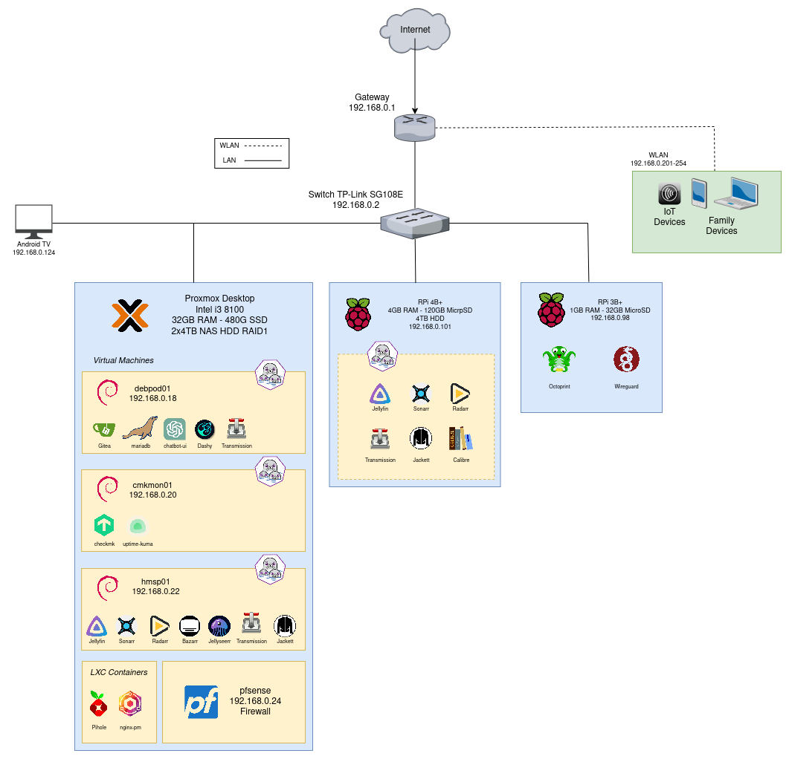

# My homelab

My homelab is the playground I use to test different technologies and study
without worrying too much about making mistakes, because that's the best way to
learn, trial and error.

This diagram was made using [draw.io](draw.io)

### Currently working on:
* Setup pfSense firewall.
* Learn and tinker with Proxmox LXC Containers.
* Reduce deployment times.
* Work on HA services.

## Hosts
### Raspberry Pi 4B+
Hardware specs:
* Processor: ARM Cortex-A72 @ 1.50GHz
* RAM: 4GiB
* Disk 0: 120G SandDisk MicroSD
* Disk 1: Seagate 4TB HDD USB 3.0
* Network: 1Gbit/s
* OS: Raspbian Lite 64 bit

Network configuration:
* IP address: 192.168.0.101
* Hostname: rpi01

Services:
* Jellyfin
* Transmission
* Sonarr
* Jackett
* Radarr
* Syncthing

### Raspberry Pi 3B+
Hardware specs:
* Processor: ARM Cortex-A53 @ 1.40GHz
* RAM: 1GiB
* Disk 0: 32G SandDisk MicroSD
* Network: eth0 100 Mbps
* OS: Raspbian Lite 64 bit

Network configuration:
* IP address: 192.168.0.98
* Hostname: rpi02

Services:
* Octoprint
* Wireguard

### Desktop Proxmox
Hardware specs:
* Processor: Intel(R) Core(TM) i3-8100 CPU @ 3.60GHz
* RAM: 32GiB DDR4 2400MHz
* Disk 0: 480GB SSD
* RAID1: 2x4TB NAS HDD
* Network: 1Gbit/s
* OS: Proxmox VE

Virtual Machines:
* debpod01: Gitea, mariadb, chatbot-ui, Dashy.
* cmkmon01: checkmk, uptime-kuma.
* hmsp01: jellyfin, jellyseerr, sonarr, radarr, bazarr, jackett, transmission.

LXC:
* pihole
* nginx-pm

